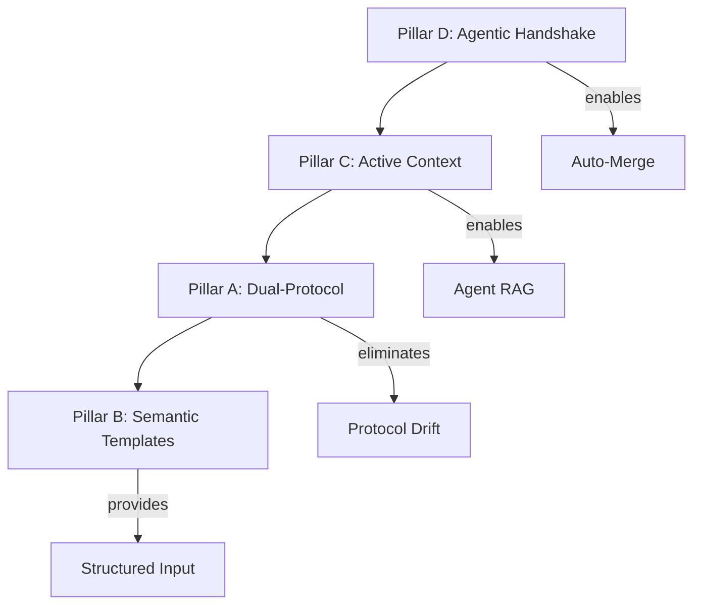

# ANALYSIS.md — Agentic Infrastructure Strategy

> **Document Type**: Strategic Analysis
> **Target Audience**: Principal Architects, Agentic Systems
> **Scope**: Self-Describing Agentic Environment for Parametric Arsenal

---

## Executive Summary

| Metric | Current | Target | Gap |
|--------|---------|--------|-----|
| **Autonomy Rate** | ~30% | >70% | Protocol fragmentation, no review loop |
| **Agent Files** | 11/11 exist | 11/11 | ✅ Complete |
| **Context Freshness** | Manual | <24h auto | No JSON generation pipeline |
| **Review→Fix→Merge** | Manual | Automated | No agentic handshake workflow |

**Critical Path**: `D (Handshake) → C (Context) → A (Protocol) → B (Templates)`

---

## 1. Infrastructure Audit

### 1.1 Protocol Layer: FRAGMENTED

```
SYNCHRONIZATION STATUS
┌────────────────────────────────────────────────────┐
│  STANDARDS.yaml (MISSING - proposed)               │
│       ↓ should generate ↓                          │
│  ┌──────────┐  ┌───────────────────────┐  ┌──────────┐ │
│  │CLAUDE.md │  │copilot-instructions.md│  │*.agent.md│ │
│  │ 1000 LOC │  │       323 LOC         │  │11 exist  │ │
│  │ CANONICAL│  │      CONDENSED        │  │ COMPLETE │ │
│  └──────────┘  └───────────────────────┘  └──────────┘ │
│       ↑              ↑                    ↑        │
│       └──── 95% DUPLICATION ──────────────┘        │
└────────────────────────────────────────────────────┘
```

**Status**: All 11 agent files exist and are referenced correctly in `.claude/settings.json`.

**Improvement Opportunity**: Standardize agent file structure and sync `[CRITICAL RULES]` sections via STANDARDS.yaml.

#### Protocol File Comparison

| Aspect | AGENTS.md (405 LOC) | copilot-instructions.md (323 LOC) |
|--------|---------------------|-----------------------------------|
| **Purpose** | Autonomous agents (CLI/CI) | IDE assist (Copilot) |
| **Critical Rules** | 5 prohibitions + 5 requirements | 10 immediate blockers |
| **Architecture** | Result, UnifiedOperation, V.*, E.* | Same (condensed) |
| **Decision Trees** | 4 detailed trees | None (reference to CLAUDE.md) |
| **Task Patterns** | 4 patterns with code | Reference only |
| **Learning Path** | 5 exemplar files | 5 exemplar files (same) |
| **Workflow** | Build/test commands | Build commands + Python |

**Duplication Analysis**:
- ~95% semantic overlap in critical rules
- copilot-instructions.md adds Python section (Ruff, mypy)
- AGENTS.md has richer inline examples and decision trees
- Both reference CLAUDE.md as canonical source

**Synchronization Risk**: HIGH — Manual sync required, no automated verification. Drift occurs when one file is updated without the other.

### 1.2 CI/CD Fabric: INCOMPLETE LOOP

```
CURRENT FLOW (manual bottleneck)
┌─────────────────────────────────────────────────────┐
│                                                     │
│  ISSUE ──▶ claude-issues ──▶ PR ──▶ claude-review  │
│  (label)   (Sonnet, 20 turns)    (Opus, 8 turns)   │
│                                       │             │
│                              ┌────────▼────────┐   │
│                              │ REQUEST_CHANGES │   │
│                              └────────┬────────┘   │
│                                       │             │
│                              ╔════════▼════════╗   │
│                              ║  HUMAN FIXES    ║ ← BOTTLENECK
│                              ╚════════╤════════╝   │
│                                       │             │
│                              ┌────────▼────────┐   │
│                              │  MANUAL MERGE   │ ← BOTTLENECK
│                              └─────────────────┘   │
└─────────────────────────────────────────────────────┘

TARGET FLOW (automated)
┌─────────────────────────────────────────────────────┐
│  ISSUE ──▶ claude-issues ──▶ PR ──▶ claude-review  │
│                                       │             │
│                              ┌────────▼────────┐   │
│                              │ REQUEST_CHANGES │   │
│                              └────────┬────────┘   │
│                                       │             │
│                              ┌────────▼────────┐   │
│                              │ claude-autofix  │ ← NEW
│                              │ (reads JSON,    │   │
│                              │  applies fixes) │   │
│                              └────────┬────────┘   │
│                                       │ max 3 iterations
│                              ┌────────▼────────┐   │
│                              │   auto-merge    │ ← NEW
│                              └─────────────────┘   │
└─────────────────────────────────────────────────────┘
```

**Gaps Identified**:
| ID | Gap | Impact | Priority |
|----|-----|--------|----------|
| CI-1 | No auto-merge | Human bottleneck | **VERY HIGH** |
| CI-2 | No auto-fix | Human bottleneck | **VERY HIGH** |
| CI-3 | No agent selection in issues | Generic implementation | HIGH |
| CI-4 | Review is read-only | Cannot suggest fixes | HIGH |
| CI-5 | No coverage gate | PRs may lack tests | MEDIUM |

#### rhino-tests.yml Analysis

**Path**: `.github/workflows/rhino-tests.yml`

| Aspect | Configuration |
|--------|---------------|
| **Trigger** | Push/PR to `main` when `libs/rhino/**` or `test/rhino/**` changes |
| **Platform** | Windows-only (`net8.0-windows` TFM) |
| **Runtime** | Rhino 8 via `mcneel/setup-rhino3d@v2` |
| **Secrets** | `RHINO_TOKEN`, `RHINO_EMAIL` required |
| **Timeout** | 20 minutes |

**Diagnostic Capability**:
- Optional CoreCLR trace (`COREHOST_TRACE`) via `enable_diagnostics` input
- VSTest diagnostics on failure (last 200/100 lines)

**Integration Gap**: Rhino tests run independently of `claude-code-review.yml`. Consider:
- Adding test results to review JSON output
- Including Rhino test status in auto-merge gate

### 1.3 Gatekeepers: PRODUCTION-READY ✅

**Analyzer Stack** (6 packages in `Directory.Build.props`):
- Roslynator.Analyzers (4.14.1)
- Meziantou.Analyzer (2.0.256)
- Microsoft.CodeAnalysis.NetAnalyzers (10.0.100)
- AsyncFixer (1.6.0)
- ReflectionAnalyzers (0.3.1)
- Nullable.Extended.Analyzer (1.15.6581)

**Build Enforcement**:
- `TreatWarningsAsErrors=true`
- `EnforceCodeStyleInBuild=true`
- `AnalysisLevel=latest-all`

**Critical Rules Enforced**:
- CA1050 (one type/file)
- IDE0007-0009 (no var, explicit types)
- IDE0290 (primary constructors)
- IDE0300-305 (collection expressions)

#### Pre-commit Configuration Details

**Path**: `.pre-commit-config.yaml`

**Standard Hooks** (pre-commit/pre-commit-hooks v5.0.0):
| Hook | Purpose |
|------|---------|
| `trailing-whitespace` | Remove trailing whitespace (markdown preserved) |
| `end-of-file-fixer` | Ensure files end with newline |
| `mixed-line-ending` | Enforce LF line endings |
| `check-yaml` | Validate YAML syntax |
| `check-json` | Validate JSON syntax |
| `check-toml` | Validate TOML syntax |

**Custom Hooks**:
1. **dotnet-build**: `dotnet build -c Release` with `EnforceCodeStyleInBuild=true`, `TreatWarningsAsErrors=true`
2. **dotnet-format**: `dotnet format --verify-no-changes --verbosity quiet`

**CI Integration**: pre-commit.ci enabled with:
- Auto-fix commits with message: `style: auto-fix pre-commit hooks`
- Monthly auto-update schedule
- Auto-fix PRs enabled

**Assessment**: ✅ Production-ready — enforces identical analyzers as CI pipeline.

### 1.4 Interface Layer: UNSTRUCTURED

**Current**: Zero issue/PR templates. Workflows receive freeform text.

**Problem**: Agent cannot parse:
- Scope (which `libs/` folder?)
- Complexity (trivial/medium/hard)
- Required context files
- Validation mode requirements

**Solution**: Semantic templates with structured YAML dropdowns + hidden JSON metadata.

### 1.5 Context Layer: MANUAL DISCOVERY

**Current**: Agents must `grep` raw source to understand:
- Project structure
- Error codes (E.*)
- Validation modes (V.*)
- Exemplar metrics (LOC counts)

**Solution**: Generated JSON context files via Roslyn reflection.

---

## 2. Implementation Strategy: 4 Pillars



### Pillar A: Dual-Protocol Standard

**Principle**: Single source (`STANDARDS.yaml`) generates all protocol files.

**Deliverables**:
- `tools/standards/STANDARDS.yaml` — Canonical rules, limits, exemplars
- `tools/standards/StandardsGen.csx` — Generator script
- CI workflow to verify sync

**Eliminates**: 95% rule duplication, drift risk.

### Pillar B: Semantic Templates

**Principle**: Machine-readable first, human-readable second.

**Deliverables**:
- `.github/ISSUE_TEMPLATE/feature-claude.yml` — Dropdowns for scope, complexity, agent
- `.github/PULL_REQUEST_TEMPLATE.md` — JSON metadata block, verification checklist

**Key Fields**:
```yaml
# Structured metadata agents can parse
scope: libs/rhino/spatial
complexity: hard
agent: csharp-advanced
context_files: [Spatial.cs, SpatialCore.cs]
validation_mode: V.Standard | V.Topology
```

### Pillar C: Active Context Generation

**Principle**: Agents consume generated JSON, not raw source.

**Deliverables** (`docs/agent-context/`):
| File | Source | Content |
|------|--------|---------|
| `architecture.json` | Roslyn parse of .sln | Projects, namespaces, types, LOC |
| `error-catalog.json` | Parse E.cs | Domains, codes, messages |
| `validation-modes.json` | Parse V.cs | Flags, combinations, checks |
| `exemplar-metrics.json` | Parse exemplar files | LOC, methods, patterns |
| `domain-map.json` | Parse libs/rhino/* | 4-file pattern, API types |

**CI**: Regenerate on `libs/**/*.cs` changes, create PR (not direct commit to prevent infinite loops).

#### .NET 8 Implementation Patterns

**Required NuGet Packages** (`tools/ContextGen/ContextGen.csproj`):
```xml
<PackageReference Include="Microsoft.Build.Locator" Version="1.7.8" />
<PackageReference Include="Microsoft.CodeAnalysis.Workspaces.MSBuild" Version="4.12.0" />
<PackageReference Include="Microsoft.CodeAnalysis.CSharp.Workspaces" Version="4.12.0" />
<PackageReference Include="System.Text.Json" Version="8.0.5" />
```

**Architecture Generator** (~30 lines):
```csharp
using Microsoft.Build.Locator;
using Microsoft.CodeAnalysis;
using Microsoft.CodeAnalysis.MSBuild;

MSBuildLocator.RegisterDefaults();
using MSBuildWorkspace workspace = MSBuildWorkspace.Create();
Solution solution = await workspace.OpenSolutionAsync("Parametric_Arsenal.sln");

List<ProjectInfo> projects = [];
foreach (Project project in solution.Projects) {
    Compilation? compilation = await project.GetCompilationAsync();
    if (compilation is null) continue;

    INamedTypeSymbol[] types = compilation.GlobalNamespace
        .GetNamespaceMembers()
        .SelectMany(ns => GetAllTypes(ns))
        .ToArray();

    projects.Add(new ProjectInfo(
        Name: project.AssemblyName,
        Path: project.FilePath ?? "",
        Types: types.Select(t => new TypeInfo(
            Name: t.Name,
            Namespace: t.ContainingNamespace.ToDisplayString(),
            Kind: t.TypeKind.ToString(),
            Members: t.GetMembers().Length
        )).ToArray()
    ));
}

await File.WriteAllTextAsync("docs/agent-context/architecture.json",
    JsonSerializer.Serialize(projects, new JsonSerializerOptions { WriteIndented = true }));

static IEnumerable<INamedTypeSymbol> GetAllTypes(INamespaceSymbol ns) =>
    ns.GetTypeMembers().Concat(ns.GetNamespaceMembers().SelectMany(GetAllTypes));
```

**Error Catalog Generator** (~25 lines):
```csharp
using Microsoft.CodeAnalysis.CSharp;
using Microsoft.CodeAnalysis.CSharp.Syntax;

string ecsPath = "libs/core/errors/E.cs";
SyntaxTree tree = CSharpSyntaxTree.ParseText(await File.ReadAllTextAsync(ecsPath));
CompilationUnitSyntax root = tree.GetCompilationUnitRoot();

ClassDeclarationSyntax? eClass = root.DescendantNodes()
    .OfType<ClassDeclarationSyntax>()
    .FirstOrDefault(c => c.Identifier.Text == "E");

Dictionary<string, List<ErrorEntry>> catalog = [];
foreach (ClassDeclarationSyntax domain in eClass?.Members.OfType<ClassDeclarationSyntax>() ?? []) {
    string domainName = domain.Identifier.Text;
    List<ErrorEntry> errors = domain.Members
        .OfType<FieldDeclarationSyntax>()
        .Where(f => f.Declaration.Type.ToString() == "SystemError")
        .Select(f => new ErrorEntry(
            Name: f.Declaration.Variables.First().Identifier.Text,
            Code: ExtractErrorCode(f)
        )).ToList();
    catalog[domainName] = errors;
}

await File.WriteAllTextAsync("docs/agent-context/error-catalog.json",
    JsonSerializer.Serialize(catalog, new JsonSerializerOptions { WriteIndented = true }));
```

> **Note**: These patterns use current .NET 8 / Roslyn 4.12.0 APIs. `MSBuildLocator.RegisterDefaults()` must be called before creating `MSBuildWorkspace`.

### Pillar D: Agentic Handshake

**Principle**: Structured JSON interchange between reviewer and fixer agents.

**Protocol**:
1. `claude-code-review` outputs `.github/review-output/pr-{N}.json`
2. `claude-autofix` reads JSON, applies fixes per violation
3. Loop until `verdict: approve` OR iteration limit (3)
4. `auto-merge` triggers on all gates pass

**Review Output Schema**:
```json
{
  "pr_number": 42,
  "verdict": "approve | request_changes",
  "violations": [{
    "rule": "NO_VAR",
    "file": "path",
    "start_line": 127,
    "end_line": 127,
    "current": "var x = ...",
    "suggested": "int x = ..."
  }],
  "passed_checks": ["RULE_ID", ...]
}
```

> **Note**: `start_line`/`end_line` support multi-line changes. Fixes applied in reverse line order to prevent line shifts.

---

## 3. Tooling Decision

**Question**: `gh-aw` (GitHub Agentic Workflows) vs. custom actions?

**Decision**: **Hybrid** — Keep `anthropics/claude-code-action@v1`, add custom composite actions.

**Rationale**:
- claude-code-action is mature for Claude interactions
- gh-aw lacks MCP server config, multi-model coordination
- Custom actions fill gaps: review→fix loop, auto-merge, context gen

---

## 4. Risk Matrix

| Risk | Likelihood | Impact | Mitigation |
|------|------------|--------|------------|
| Standards drift | HIGH | HIGH | Single-source YAML + CI sync check |
| Agent rules out of sync | MEDIUM | MEDIUM | Generate `[CRITICAL RULES]` from STANDARDS.yaml |
| Review loop infinite | LOW | HIGH | Max 3 iterations hard limit |
| Context staleness | MEDIUM | MEDIUM | CI-triggered regeneration |

---

## 5. Success Metrics

| Metric | Current | Target | Measurement |
|--------|---------|--------|-------------|
| Issue→Merge (no human) | ~30% | >70% | Bot-only PRs |
| Review iterations avg | N/A | <2 | JSON aggregation |
| Time to merge | ~4h | <1h | GitHub API |
| Agent specialization | 0% | >80% | Invocation logs |
| Context freshness | N/A | <24h | File timestamps |

---

## 6. Critical Path — Immediate Actions

```
PHASE 1 (CRITICAL) — Unblock agent autonomy
├── I-5: Review output schema (blocks CD-2, CD-4)
├── CD-4: Add JSON output to claude-code-review
├── CD-2: Create claude-autofix.yml workflow
└── CD-3: Create auto-merge.yml workflow

PHASE 2 (HIGH) — Enable structured input
├── P-1/P-2/P-3: STANDARDS.yaml + generator + agent sync
├── C-1/C-7: ContextGen tool + CI workflow
└── I-1/I-3: Issue + PR templates

PHASE 3 (MEDIUM) — Complete context layer
├── C-2→C-8: Context generators
├── CD-1/CD-5→CD-7: Workflow enhancements
└── Additional templates (I-2, I-4, I-6)

PHASE 4 (LOW) — Polish
└── P-4→P-8, CD-8→CD-9, CONTRIBUTING.md
```

**Total Effort**: ~46 hours → 70% autonomy target

---

*Strategic analysis complete. Proceed to TASK_FINAL.md for execution checklist.*
