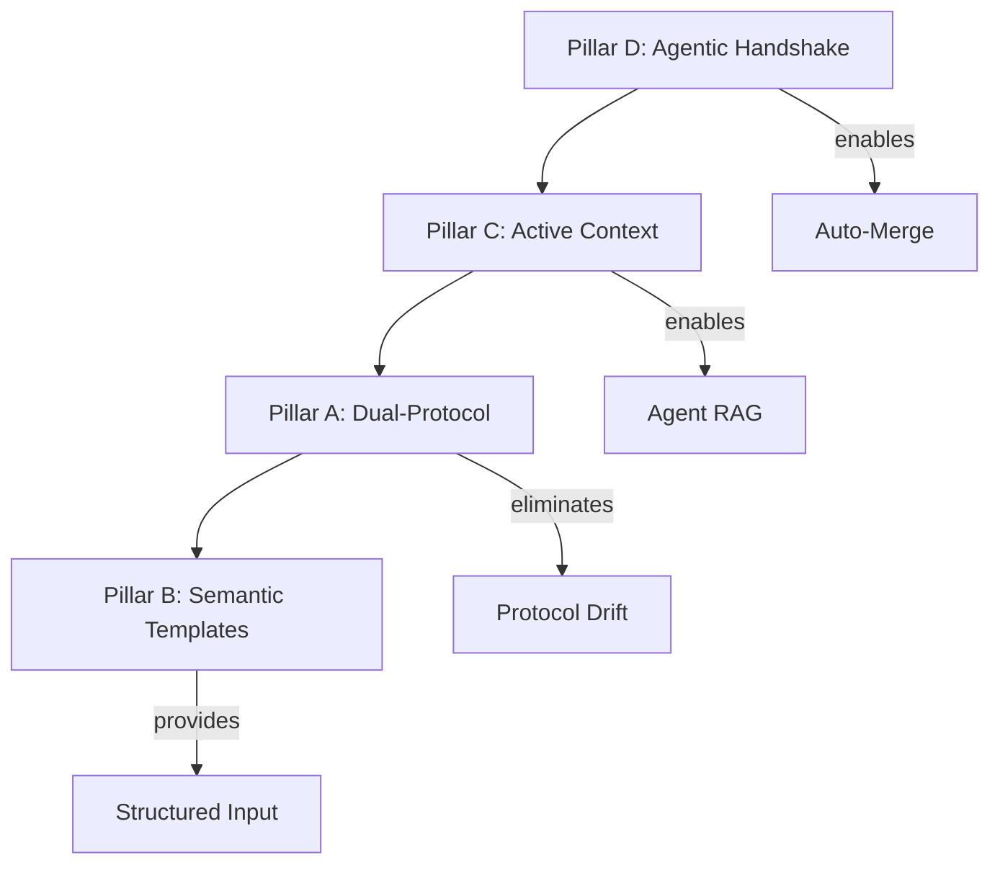

# ANALYSIS.md — Agentic Infrastructure Strategy

> **Document Type**: Strategic Analysis
> **Target Audience**: Principal Architects, Agentic Systems
> **Scope**: Self-Describing Agentic Environment for Parametric Arsenal

---

## Executive Summary

| Metric | Current | Target | Gap |
|--------|---------|--------|-----|
| **Autonomy Rate** | ~30% | >70% | Protocol fragmentation, no review loop |
| **Agent Files** | 5/11 exist | 11/11 | 6 MISSING files block specialization |
| **Context Freshness** | Manual | <24h auto | No JSON generation pipeline |
| **Review→Fix→Merge** | Manual | Automated | No agentic handshake workflow |

**Critical Path**: `D (Handshake) → C (Context) → A (Protocol) → B (Templates)`

---

## 1. Infrastructure Audit

### 1.1 Protocol Layer: FRAGMENTED

```
SYNCHRONIZATION STATUS
┌────────────────────────────────────────────────────┐
│  STANDARDS.yaml (MISSING - proposed)               │
│       ↓ should generate ↓                          │
│  ┌──────────┐  ┌──────────────────┐  ┌──────────┐ │
│  │CLAUDE.md │  │copilot-instruct. │  │*.agent.md│ │
│  │ 1000 LOC │  │    323 LOC       │  │ 5 exist  │ │
│  │ CANONICAL│  │   CONDENSED      │  │ 6 MISSING│ │
│  └──────────┘  └──────────────────┘  └──────────┘ │
│       ↑              ↑                    ↑        │
│       └──── 95% DUPLICATION ──────────────┘        │
└────────────────────────────────────────────────────┘
```

**CRITICAL**: `.claude/settings.json` references 11 agents, only 5 exist:
- ✅ csharp-advanced, testing-specialist, refactoring-architect, rhino-implementation, performance-analyst
- ❌ **MISSING**: cleanup-specialist, library-planner, documentation-specialist, integration-specialist, grasshopper-implementation, plugin-architect

**Impact**: Agent invocation fails or uses stale 1-sentence inline prompts.

### 1.2 CI/CD Fabric: INCOMPLETE LOOP

```
CURRENT FLOW (manual bottleneck)
┌─────────────────────────────────────────────────────┐
│                                                     │
│  ISSUE ──▶ claude-issues ──▶ PR ──▶ claude-review  │
│  (label)   (Sonnet,20t)          (Opus,8t)         │
│                                       │             │
│                              ┌────────▼────────┐   │
│                              │ REQUEST_CHANGES │   │
│                              └────────┬────────┘   │
│                                       │             │
│                              ╔════════▼════════╗   │
│                              ║  HUMAN FIXES    ║ ← BOTTLENECK
│                              ╚════════╤════════╝   │
│                                       │             │
│                              ┌────────▼────────┐   │
│                              │  MANUAL MERGE   │ ← BOTTLENECK
│                              └─────────────────┘   │
└─────────────────────────────────────────────────────┘

TARGET FLOW (automated)
┌─────────────────────────────────────────────────────┐
│  ISSUE ──▶ claude-issues ──▶ PR ──▶ claude-review  │
│                                       │             │
│                              ┌────────▼────────┐   │
│                              │ REQUEST_CHANGES │   │
│                              └────────┬────────┘   │
│                                       │             │
│                              ┌────────▼────────┐   │
│                              │ claude-autofix  │ ← NEW
│                              │ (reads JSON,    │   │
│                              │  applies fixes) │   │
│                              └────────┬────────┘   │
│                                       │ max 3 iter │
│                              ┌────────▼────────┐   │
│                              │   auto-merge    │ ← NEW
│                              └─────────────────┘   │
└─────────────────────────────────────────────────────┘
```

**Gaps Identified**:
| ID | Gap | Impact | Priority |
|----|-----|--------|----------|
| CI-1 | No auto-merge | Human bottleneck | **VERY HIGH** |
| CI-2 | No auto-fix | Human bottleneck | **VERY HIGH** |
| CI-3 | No agent selection in issues | Generic implementation | HIGH |
| CI-4 | Review is read-only | Cannot suggest fixes | HIGH |
| CI-5 | No coverage gate | PRs may lack tests | MEDIUM |

### 1.3 Gatekeepers: PRODUCTION-READY ✅

Analyzer stack is mature:
- **6 packages**: Roslynator, Meziantou, NetAnalyzers, AsyncFixer, ReflectionAnalyzers, Nullable.Extended
- **TreatWarningsAsErrors=true** in `Directory.Build.props`
- **Pre-commit**: `dotnet build` + `dotnet format --verify-no-changes`

Critical rules enforced: CA1050 (one type/file), IDE0007 (no var), IDE0290 (primary constructors), IDE0300-305 (collections).

### 1.4 Interface Layer: UNSTRUCTURED

**Current**: Zero issue/PR templates. Workflows receive freeform text.

**Problem**: Agent cannot parse:
- Scope (which `libs/` folder?)
- Complexity (trivial/medium/hard)
- Required context files
- Validation mode requirements

**Solution**: Semantic templates with structured YAML dropdowns + hidden JSON metadata.

### 1.5 Context Layer: MANUAL DISCOVERY

**Current**: Agents must `grep` raw source to understand:
- Project structure
- Error codes (E.*)
- Validation modes (V.*)
- Exemplar metrics (LOC counts)

**Solution**: Generated JSON context files via Roslyn reflection.

---

## 2. Implementation Strategy: 4 Pillars



### Pillar A: Dual-Protocol Standard

**Principle**: Single source (`STANDARDS.yaml`) generates all protocol files.

**Deliverables**:
- `tools/standards/STANDARDS.yaml` — Canonical rules, limits, exemplars
- `tools/standards/StandardsGen.csx` — Generator script
- CI workflow to verify sync

**Eliminates**: 95% rule duplication, drift risk.

### Pillar B: Semantic Templates

**Principle**: Machine-readable first, human-readable second.

**Deliverables**:
- `.github/ISSUE_TEMPLATE/feature-claude.yml` — Dropdowns for scope, complexity, agent
- `.github/PULL_REQUEST_TEMPLATE.md` — JSON metadata block, verification checklist

**Key Fields**:
```yaml
# Structured metadata agents can parse
scope: libs/rhino/spatial
complexity: hard
agent: csharp-advanced
context_files: [Spatial.cs, SpatialCore.cs]
validation_mode: V.Standard | V.Topology
```

### Pillar C: Active Context Generation

**Principle**: Agents consume generated JSON, not raw source.

**Deliverables** (`docs/agent-context/`):
| File | Source | Content |
|------|--------|---------|
| `architecture.json` | Roslyn parse of .sln | Projects, namespaces, types, LOC |
| `error-catalog.json` | Parse E.cs | Domains, codes, messages |
| `validation-modes.json` | Parse V.cs | Flags, combinations, checks |
| `exemplar-metrics.json` | Parse exemplar files | LOC, methods, patterns |
| `domain-map.json` | Parse libs/rhino/* | 4-file pattern, API types |

**CI**: Regenerate on `libs/**/*.cs` changes, commit to repo.

### Pillar D: Agentic Handshake

**Principle**: Structured JSON interchange between reviewer and fixer agents.

**Protocol**:
1. `claude-code-review` outputs `.github/review-output/pr-{N}.json`
2. `claude-autofix` reads JSON, applies fixes per violation
3. Loop until `verdict: approve` OR iteration limit (3)
4. `auto-merge` triggers on all gates pass

**Review Output Schema**:
```json
{
  "verdict": "approve | request_changes",
  "violations": [{
    "rule": "NO_VAR",
    "file": "path",
    "line": 127,
    "current": "var x = ...",
    "suggested": "int x = ..."
  }]
}
```

---

## 3. Tooling Decision

**Question**: `gh-aw` (GitHub Agentic Workflows) vs. custom actions?

**Decision**: **Hybrid** — Keep `anthropics/claude-code-action@v1`, add custom composite actions.

**Rationale**:
- claude-code-action is mature for Claude interactions
- gh-aw lacks MCP server config, multi-model coordination
- Custom actions fill gaps: review→fix loop, auto-merge, context gen

---

## 4. Risk Matrix

| Risk | Likelihood | Impact | Mitigation |
|------|------------|--------|------------|
| Standards drift | HIGH | HIGH | Single-source YAML + CI sync check |
| Agent file missing | **CONFIRMED** | HIGH | Create 6 files immediately |
| Review loop infinite | LOW | HIGH | Max 3 iterations |
| Context staleness | MEDIUM | MEDIUM | CI-triggered regeneration |

---

## 5. Success Metrics

| Metric | Current | Target | Measurement |
|--------|---------|--------|-------------|
| Issue→Merge (no human) | ~30% | >70% | Bot-only PRs |
| Review iterations avg | N/A | <2 | JSON aggregation |
| Time to merge | ~4h | <1h | GitHub API |
| Agent specialization | 0% | >80% | Invocation logs |
| Context freshness | N/A | <24h | File timestamps |

---

## 6. Critical Path — Immediate Actions

```
PHASE 1 (CRITICAL) — Unblock agent autonomy
├── P-3: Create 6 missing agent files
├── CD-2: Create claude-autofix.yml workflow
├── CD-3: Create auto-merge.yml workflow
└── CD-4: Add JSON output to claude-code-review

PHASE 2 (HIGH) — Enable structured input
├── C-1/C-2/C-7: ContextGen tool + CI workflow
├── P-1/P-2: STANDARDS.yaml + generator
└── I-1/I-3: Issue + PR templates

PHASE 3 (MEDIUM) — Polish
├── Remaining context generators (C-3 to C-6)
├── Additional templates (I-2, I-4, I-6)
└── Documentation (P-6, CONTRIBUTING.md)
```

**Total Effort**: ~73 hours → 70% autonomy target

---

*Strategic analysis complete. Proceed to TASK_FINAL.md for execution checklist.*
